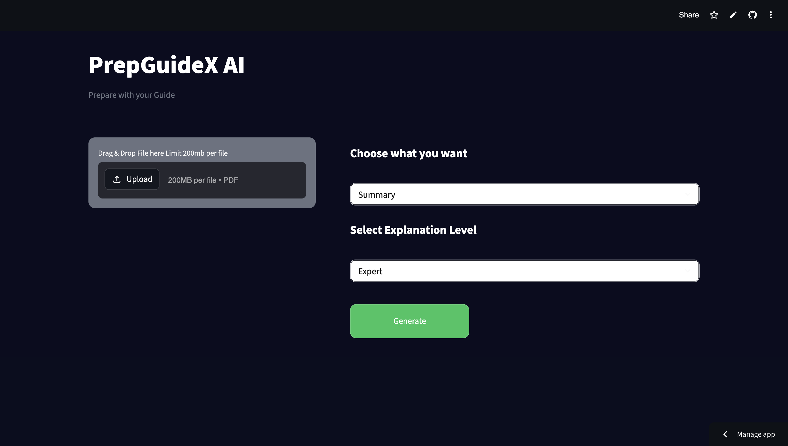
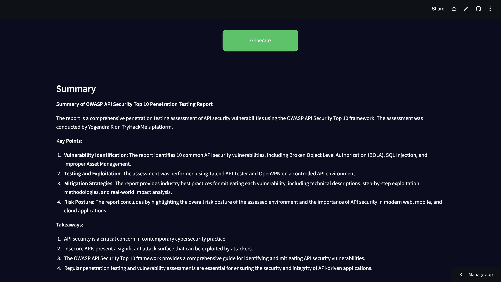

# PrepGuideX AI 📘

An AI-powered PDF assistant that helps users analyze documents and generate insights using LLM.

---

## 🚀 Features
- Upload PDF files
- Generate summaries
- Extract key points
- Extract keywords
- Generate questions
- Ask doubts from the document
- Multiple explanation levels (Beginner, Intermediate, Expert)

---

## 🛠 Tech Stack
- Python
- Streamlit
- LLM

---

## 📸 Screenshots

### User Interface

### Output Result

